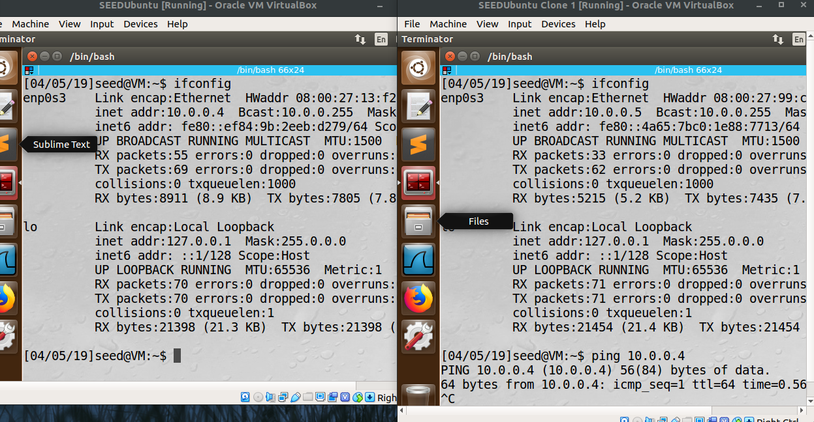
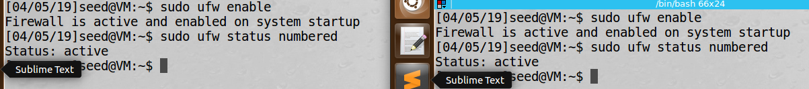
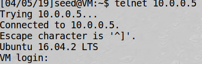
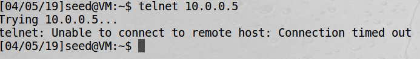
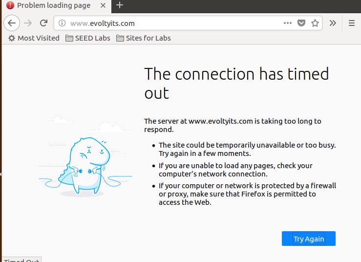
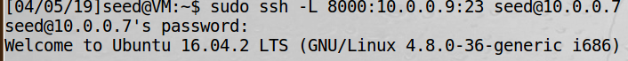
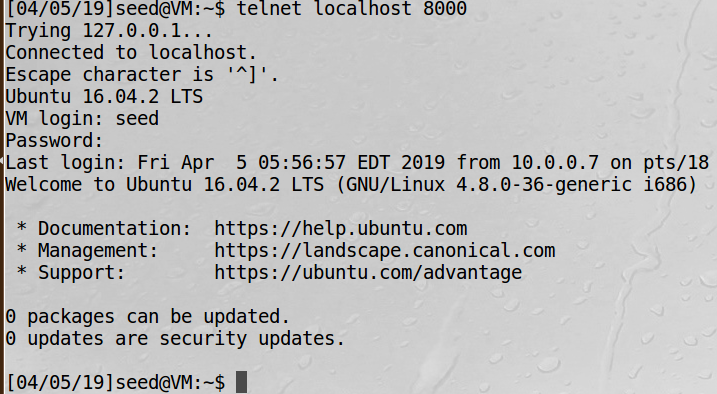
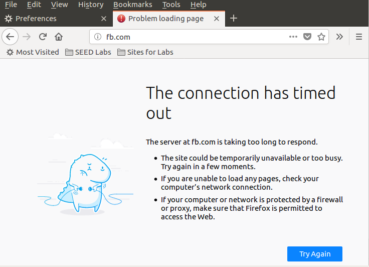
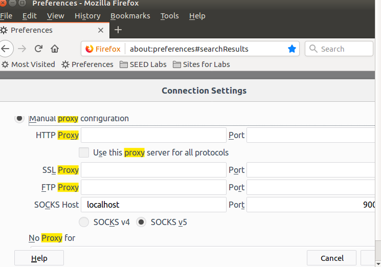
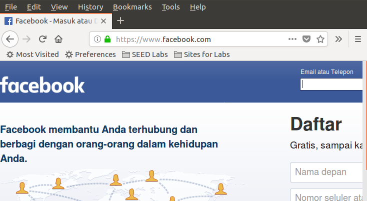

### SEEDLAB : FIREWALL by Dito Prabowo

***

#### 0x0 Intro
Tujuan dari lab ini adalah kita tau bagaimana kerja dari sebuah firewall dengan bermain main dengan firewall dan mengimplementasikan packet filtering simple dalam firewall. Dalam firewall ada beberapa type, dalam lab ini kita fokus pada packet filter. Filter paket memeriksa paket dan memutuskan apakah akan di drop atau di forward berdasarkan aturan dari firewal yang kita setting. Paket filter sering menggunakan kombinasi dari sumber dan alamat tujuan suatu paket,protokol, TCP dan UDP, dan port number. Di lab ini ada topic :

* Firewall
* Netfilter
* Loadable kernel module
* SSH tunnel

#### 0x1 LAB TASK

##### Task 1 : Using Firewall

Dalam lab ini kita membutuhkan 2 vm dengan tujuan sebagai berikut :

* Prevent A from doing telnet to Machine B.
* Prevent B from doing telnet to Machine A.
* Prevent A from visiting an external web site. You can choose any web site that you like to block, but
keep in mind, some web servers have multiple IP addresses

1. Sebelum Mulai kita clone seed vm
2. Setelah clone, kita buat private network dalam virtualbox nya sesuai dengan dokumentasi virtualbox agar 2 vm berada dalam satu network.
(disini saya membuat NAT dengan nama DitoNetwork dan kedua vm menggunakan nat tersebut)

Machine A IP : 10.0.0.4
Machine B IP : 10.0.0.5

kedua Machine sudah bisa berkomunikasi (bisa di ping)

3. buat edit config ufw default dari drop ke accept

    #Set the default input policy to ACCEPT, DROP, or REJECT. Please note that if
    #you change this you will most likely want to adjust your rules.
    DEFAULT_INPUT_POLICY="DROP" *

Setelah persiapan selesai, mari kita lakukan percobaan A tidak bisa telnet B dan B tidak bisa telnet ke A

lakukan dulu command untuk mengaktifkan ufw :

    sudo ufw enable

sebelum setting ufw, saya coba dulu telnet ke Machine B dan bisa connect.

selanjutnya kita coba block telnet dengan firewal ufw pada machine b

    sudo ufw deny from 10.0.0.4 to any port 23

Setelah nya, kita coba telnet dari A ke B

begitu juga pada machine B di block dengan firewal ufw,

    sudo ufw deny from 10.0.0.5 to any port 23

Dan hasilnya sama, tidak bisa melakukan telnet ke machine A.

berikutnya kita coba block suatu website, disini saya mencoba untuk memblokir situs web evoltyits.com(web yg saya buat yg telah di publish dan punya 1 IP, kalo pakek media social biasanya punya beberapa ip) dalam machine A.

sebelumnya kita buka firefox dan coba buka situnya, hasilnya bisa dibuka.

selanjutnya, kita coba block dengan ufw

    sudo ufw deny out to 156.67.212.191 port 80

dan hasilnya :

***

#### TASK 3 : Evading Egress Filtering

Tujuan pada task ini, kita bisa menggunakan service telnet dan fb yg sebelumnya sudah di blokir (bypass) menggunakan ssh tunneling ke machine lainnya yg tidak di blokir (machine C).

(IP BARU)

Machine A : 10.0.0.8,

MAchine B : 10.0.0.7,

Machine C : 10.0.0.9,

IP FB baru(dilihat dengan nslookup) : 157.240.13.35

sebelumnya pada machine A kita atur, block telnet ke IP machine C, dan block situs web fb.

    sudo ufw deny out to 10.0.0.9 port 23
    sudo ufw deny out to 157.240.13.35 port 80

setelah kita atur, kita tidak bisa telnet dari A ke C dan dalam machine A kita tidak bisa membuka situs facebook.com

Telnet ke C menggunakan ssh ke B dengan port 8000 pada machine A

      ssh -L 8000:10.0.0.9:23 seed@10.0.0.7

Lalu pada Machine A juga, kita coba telnet ke localhost port 8000

      telnet localhost 8000

kita berhasil telnet ke machine c dengan ssh ke b.

kita berhasil karena kita telnet dari machine A ke machine C melewati machine B, setiap paket akan dianggap sebagai paket ssh A ke B dan dari B akan meneruskan ke telnet machine C, sesuai gambar pada modul seedlab, oleh karena itu kita bisa membypass firewal a ke c lewat machine b, dan untuk detailnya kita bisa menggunakan wireshark untuk melihat keterangan nya, tapi tidak saya lakukan karena inti dari ilmunya sama.

selanjutnya kita coba mengakses facebook Dari machine A yang telah di blok aksesnya menggunakan ssh tunnel.

Pada machine A lakukan ssh ke machine B :

      ssh -D 9000 -C seed@10.0.0.7

parameter -D untuk melakukan port forwarding yang basicnya merubah sshclient menjadi sebuah proxy server (SOCKS) aplikasi protokol yg digunakan untuk mengakses dari remote machine.

untuk mengecek nya kita masukan proxy localhost dengan port 9000 pada firefox dan coba akses facebook.com

Sebelum memakai proxy kita tidak bisa mengakses fb.com karena dalam firewal kita atur akan deny apabila melakukan koneksi ke ip fb.com.

sekarang kita atur proxy nya :

dan kita coba akses facebook :

Kita bisa akses facebook menggunakan proxy SOCK5 dari client B

***

#### TASK 4 : Evading Ingress Filtering
